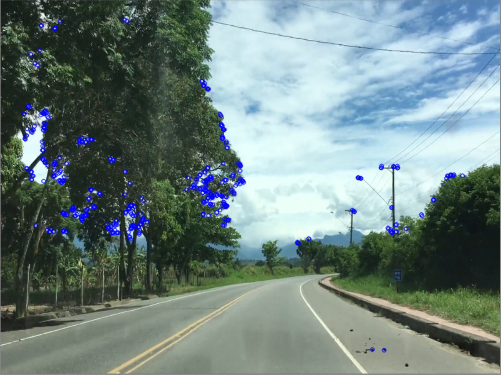

# vidSLAM
 

## What is vidSLAM?
vidSLAM is a Feature-based visual SLAM program which preforms SLAM on a given video using Structure from Motion(SfM) 

## Installing and Running vidSLAM
1. Install the dependencies listed below
2. run the command ```https://github.com/Brad1141/vidSLAM.git```
3. Open the repo and run the file```main.py```
- ```main.py``` accepts two arguments ```-video``` and ```-fov```
- ```-video``` The path of the video file (the default video is ```drive.mp4```)
- ```-fov``` The field of view for the camera of the video (The default is 60)

## Dependancies
- Matplotlib ```pip install matplotlib```
- OpenCV ```pip install opencv-python```
- Numpy ```pip install numpy```

## More Info
This project was originally part of a tutorial I made on how to do feature based visual SLAM. Feel free to check out the [tutorial series](https://roving-robots.com/2020/06/16/feature-based-visual-slam-tutorial-part-1/) for more details on the methods and features used in vidSLAM.


